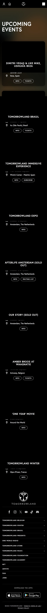

# Procesverslag
Markdown is een simpele manier om HTML te schrijven.  
Markdown cheat cheet: [Hulp bij het schrijven van Markdown](https://github.com/adam-p/markdown-here/wiki/Markdown-Cheatsheet).

Nb. De standaardstructuur en de spartaanse opmaak van de README.md zijn helemaal prima. Het gaat om de inhoud van je procesverslag. Besteedt de tijd voor pracht en praal aan je website.

Nb. Door *open* toe te voegen aan een *details* element kun je deze standaard open zetten. Fijn om dat steeds voor de relevante stuk(ken) te doen.

## Jij

  
uitwerken voor kick-off werkgroep

  ### Auteur:
  Niels van Veen

  #### Je startniveau:
  Blauw

  #### Je focus:
  hier je focus (kies uit responsive óf surface plane)
 

## Je website

  
uitwerken voor kick-off werkgroep

  ### Je opdracht:
  https://www.tomorrowland.com/home/  
  

  #### Screenshot(s) van de eerste pagina (small screen): 
  Tomorrowland home pagina
  

  #### Screenshot(s) van de tweede pagina (small screen):
  Tomorrow land calender 
  
 

## Opdracht lettertype (week 1)
Tijdens de opdracht van de lettertypes kwam ik erachter dat ik niet meer alles weet van vorig jaar. Ik moest bijvoorbeeld vaak dingen vragen aan ChatGPT. Zo wist ik niet meer hoe ik een schaduw moest toevoegenHet is me uiteindeijk wel redelijk gelukt vind ik: ik heb er 2 goed na kunnen maken.

## Toegankelijkheidstest tijdens de les (week 1)

## Brillen tijdens de les
Tijdens de les kregen wij brillen uitgedeeld. Met deze brillen konden wij het ervaren hoe het is als je minder goed kan zien. Dit best wel gek om te ervaren, want bij sommige brillen kon je echt nauwelijks wat zien.

## Elastiekjes om je vingers
Tijdens de les kregen wij elastiekjes om onze vingers en moesten we vervolgens een berichtje typen. Dit was erg lastig. Het is me ook niet gelukt om normaal te kunnen typen. Ik ben bijvoorbeeld meer m'n middelvinger gaan gebruiken tijdens het typen. Na een tijdje ging het wel beter. 

## Toegankelijkheidstest 1 (week 1)
Tijdens de les moesten wij met behulp van de voice over onze gekozen website op toegankelijkheid testen. Toen ik de voice over aanzetten kreeg ik in een keer heel veel informatie. Ik snapte ook niet zo goed hoe ik mijn voice over moest bedienen: de voice over las alleen maar het bovenste menu van m'n mac & de tabs in Google Chrome voor. Ik ben ongeveer 5 minuten aan het 'spelen' geweest met de voice over, en had nog steeds niet door hoe hij precies werkte. Na een tijdje heb ik hulp gevraagd aan Dok. Hij snapte ook niet wat er aan de hand was. Ik heb vervoglens geprobeerd om op een knop te drukken. Hier reageerde de voice over ook niet op. Ik heb vervolgens de website van Rijksoverheid opgezocht (omdat ik wist dat deze wel werkt met een voice over). Dit werkte inderdaad goed met de voice over. Ik ben toen teruggegaan naar de website van tomorrowland gegaan. Na een tijdje ben ik de tekst links onder in mijn scherm van de voice over gaan lezen. Hierdoor kreeg ik de voice over wat makkelijker door. Later ben ik erachter gekomen dat het ook deels aan de website van Tomorrowland lag. 

  
uitwerken na test in 2e werkgroep

  ### Bevindingen
  Lijst met je bevindingen die in de test naar voren kwamen:
  * Geen duidelijke hierarchie, de voice over begon met het voorlezen van drie achtergronden
  * De afbeelding in de header bestaat volledig uit een link, in deze link zit nog een knop (dit was voor de voice over verwarrend)
  * De afbeeldingen op de website hebben geen alt tekst
  * List 5 items en geen navigatie menu
  * De afbeeldingen in de calender bestaan ook uit links, dit is echter wel goed beschreven omdat er geen knop in de card zit
  * Er staat een pop up linksonderaan de website, deze wordt door de screenreader niet direct voorgelezen terwijl dit wel belangrijk is
  * De alternatieve tekst van bepaalde afbeeldingen zijn niet duidelijk genoeg
  
## Toegankelijkheidstest 2 (week 1)
### Bevindingen
  
  ## Inhoud ##
  * De knoppen hebben niet altijd een duidelijke inhoud/label --> "simulate package", "Info" en "Meer"
  * De tekst is over het algemeen gecentreerd, dit is volgens de checklist moeilijker te lezen
  
    ## Globale code ##
    * Er is bij de huidige website niet vermeld in welke taal de website is geschreven --> lang="eng" toevoegen in HTML
    * Er wordt een afsluitende slash gebruikt op lege elementen, dit heeft volgens de validator geen zin
    * Er wordt in de huidige website over het algemeen gebruik gemaakt van EM in plaats van pixel, waardoor de website makkelijk te vergroten is. Dit gebeurt echter nog niet op alle plaatsen.
    * In de huidige website wordt er niet gebruik gemaakt van landmarkelementen. Zo ontbreekt het MAIN element
    * Op deze website wordt niet gebruikt gemaakt van autofocus
    * De website geeft op dit moment de gebruikte iframes geen duidelijke naam
    * Het is niet mogelijk om met tab op de knop in de hero te drukken
    * De active state die wordt gebruikt tijdens het navigeren met tab is duidelijk, maar is niet bij alle elementen aanwezig
    * De focusvolgorde komt over het algemeen overeen met de visuele lay-out, behalve bij de knop bovenaan de pagina (hero section)
    * Er wordt niet bij elke afbeelding een duidelijke alt tekst geplaatst
    * In de huidige website staan er kopteksten die op een duidelijke manier de bijbehorende inhoud introduceren
    * Er worden geen kopniveaus over geslagen
    * Er is geen ondertiteling aanwezig bij de video's op de website
    * Er wordt op de website op dit moment geen gebruik gemaakt van CAPTCHA
    * Het contrast van de elementen op de website is goed (volgens Google inspector)

## Breakdownschets (week 1)

  
uitwerken na afloop 3e werkgroep

  ### de hele pagina: 
  

  ### dynamisch deel (bijv menu): 
  

  ### wellicht nog een dynamisch deel (bijv filter): 
  

## Oefening - Mini-symposium (week 2)
In week 2 hadden wij een Mini-symposium. Hierin spraken mensen met een beperking over de toegankelijheid van een website. Ik vond dit heel erg interessant. Zo vertelde een vrouw die doof is dat zij vaak gebeld wordt na aanleiding van het invullen van een formulier. Er wordt bijvoorbeeld vaak gevraagd om een telefoonnummer. Als oplossing gaf zij het plaatsen van een checkbox bij het inputfield met de vraag of iemand doof is (zodat er dan alleen om een e-mail gevraagd wordt). Ook gaf de vrouw aan dat er weinig aandacht wordt besteed aan het maken van een goed en duidelijk transcript voor een video. Ook wordt er vaak geen duidelijke alt tekst bij een afbeelding geplaatst. Ze gaf aan dat ze hierdoor niet alle informatie meekrijgt.

Daarnaast sprak ook een blinde man over de toegankelijkheid van websites voor hem. Hij gaf een live demo waarin hij liet zien hoe hij een website bezoekt. Dit was echt bizar om te zien. Hoe snel hij met de screen reader om kon gaan. Ook liet hij zien hoeveel moeite hij heeft met een niet goed gestructureerde website. Hiervan gaf hij een later bijgeprobeerde cookies melding als voorbeeld. Doordat deze later is bijgebouwd, veranderd de structuur waardoor het lastiger wordt voor een screenreader om deze in de juiste volgorde voor te lezen..

## Voortgang 1 (week 2)

  
uitwerken voor 1e voortgang

  ### Stand van zaken
  hier dit ging goed & dit was lastig (neem ook screenshots op van delen van je website en code)

  ### Agenda voor meeting
  samen met je groepje opstellen

  | student 1      | student 2          | student 3    | student 4        |
  | ---            | ---                | ---          | ---              |
  | dit bespreken  | en dit             | en ik dit    | en dan ik dat    |
  | en dat ook nog | dit als er tijd is | nog een punt | dit wil ik zeker |
  | ...            | ...                | ...          | ...              |

  ### Verslag van meeting
  hier na afloop snel de uitkomsten van de meeting vastleggen

  - punt 1
  - punt 2
  - nog een punt
  - ...

## Voortgang 2 (week 3)

  
uitwerken voor 2e voortgang

  ### Stand van zaken
  hier dit ging goed & dit was lastig (neem ook screenshots op van delen van je website en code)

  ### Agenda voor meeting
  samen met je groepje opstellen

  | student 1      | student 2          | student 3    | student 4        |
  | ---            | ---                | ---          | ---              |
  | dit bespreken  | en dit             | en ik dit    | en dan ik dat    |
  | en dat ook nog | dit als er tijd is | nog een punt | dit wil ik zeker |
  | ...            | ...                | ...          | ...              |

  ### Verslag van meeting
  hier na afloop snel de uitkomsten van de meeting vastleggen

  - punt 1
  - punt 2
  - nog een punt
- ...

## Toegankelijkheidstest 2/2 (week 4)

  
uitwerken na test in 9e werkgroep

  ### Bevindingen
  Lijst met je bevindingen die in de test naar voren kwamen (geef ook aan wat er verbeterd is):

## Voortgang 3 (week 4)

  
uitwerken voor 3e voortgang

  ### Stand van zaken
  hier dit ging goed & dit was lastig (neem ook screenshots op van delen van je website en code)

  ### Agenda voor meeting
  samen met je groepje opstellen

  | student 1      | student 2          | student 3    | student 4        |
  | ---            | ---                | ---          | ---              |
  | dit bespreken  | en dit             | en ik dit    | en dan ik dat    |
  | en dat ook nog | dit als er tijd is | nog een punt | dit wil ik zeker |
  | ...            | ...                | ...          | ...              |

  ### Verslag van meeting
  hier na afloop snel de uitkomsten van de meeting vastleggen

  - punt 1
  - punt 2
  - nog een punt
  - ...

## Eindgesprek (week 5)

  
uitwerken voor eindgesprek

  ### Je uitkomst - karakteristiek screenshots:
  

  ### Dit ging goed/Heb ik geleerd: 
  Korte omschrijving met plaatjes

  

  ### Dit was lastig/Is niet gelukt:
  Korte omschrijving met plaatjes

  

## Bronnenlijst

  
continu bijhouden terwijl je werkt

  Nb. Wees specifiek ('css-tricks' als bron is bijv. niet specifiek genoeg). 
  Nb. ChatGpT en andere AI horen er ook bij.
  Nb. Vermeld de bronnen ook in je code.

  1. bron 1
  2. bron 2
  3. ...

